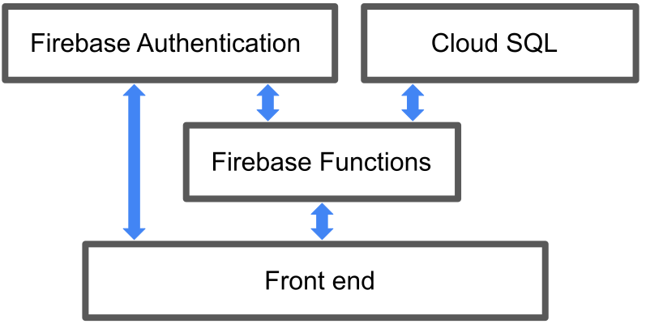
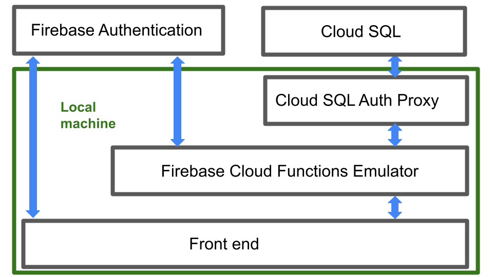

# MIT xPRO Professional Certificate Full Stack Engineering 
## Bad Bank Capstone Project November 2021

### Introduction
This the back-end part of a Bad Bank project completed in fulfillment of MIT xPRO Professional Certificate Full Stack Engineering course. It uses the following cloud architecture. 



### Deployment
After cloning this repo, development and deployment it to Google Cloud Platform (GCP) may be accomplished using the following steps.

### Step 1: Create a Google Cloud Platform project 
Create a project in the GCP console, and add the following resources: 
* Firebase Cloud Functions
* Firebase Authentication  
* Cloud SQL 

Then do the following steps to configure the project. 
* Enable the Cloud SQL Admin API for this project. 
* Create a service account with Firebase Authentication permission. You can download and save the service account json secret file. (This service account json secret file will be used in the Cloud Functions project to connect to Firebase Authentication.)

### Step 2: Create a Cloud SQL Database instance in GCP
In Cloud Shell, connect to your instance and configure the database. 
* Create a database named bad_bank.
  * `CREATE DATABASE bad_bank; USE bad_bank;` 
* Create the following tables in bad_bank: 
  * `CREATE TABLE CustomersTable (CustomerId VARCHAR(100), Fname VARCHAR(100), Lname  VARCHAR(100), Email VARCHAR(100), Telephone VARCHAR(100), AccountNumber INT, AccountBalance DECIMAL(15,2));`
  * `CREATE TABLE TransactionsTable (AccountNumber INT, TransactionTime INT, TransactionAmount DECIMAL(15,2), Payee VARCHAR(100));`

In the GCP Console, create new user , e.g. "myinstance" and password, "mypassword" , for the SQL instance 

### Step 3: Initialize the firebase project in your local directory and attach it to your GCP Project
You can do this step using the Firebase CLI. Don't forget to run `npm i --save` to install the dependencies including the promise-mysql dependency. 

### Step 4: Connect Cloud Functions to Cloud SQL instance and Firebase Authentication 
To connect to Cloud SQL: 
* In the firebase functions, set the environment variables as follows by entering this in the command line in the functions folder: 
 ```
 firebase functions:config:set mysql.db_user="myinstance" mysql.db_pass="MyPassword" mysql.db_name="bad_bank" mysql.cloud_sql_connection_name="<gcp project name>:<region>:<instance name>"
 ```

To connect Cloud Functions to Firebase Authentication: 
* Put the service account json secret file created in step 1 under functions/Secrets in the project folder. 

 
### Development 
The following environment was used on a local machine to develop this project. 
<!--  -->


Below are the steps used to run this development environment on a local machine. 
* Start the [Cloud SQL Auth Proxy](https://cloud.google.com/sql/docs/mysql/connect-admin-proxy#connect-tcp) using TCP Sockets (I was unsuccessful trying to get UNIX Sockets to work with Firebase Functions Emulator)
* Add a .runtimeconfig JSON file under the functions/ folder with the following configuration information. 
```
 {
  "mysql": {
    "db_pass": "MyPassword",
    "db_user": "myinstance",
    "db_name": "bad_bank",
    "cloud_sql_connection_name": "<'gcp project name'>:<'region'>:<'instance name'>"
  },
 // ... other configuration options
}
```
* The development environment uses TCP Sockets and the production deployment uses UNIX Sockets to connect to Cloud SQL Auth Proxy / Cloud SQL. Toggle between the two in the getQuery function in functions/index.js: 

Development
```
//mySqlDb.createUnixSocketPool()
mySqlDb.createTcpPool()
```

Production
```
mySqlDb.createUnixSocketPool()
// mySqlDb.createTcpPool()
```

### Deployment 
Run `firebase deploy` from functions/ folder 

